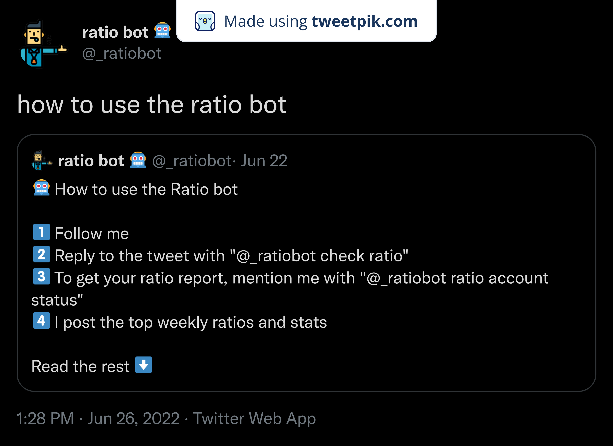

# Ratio Bot 🤖

> 

## Introduction

> A bot that checks if a tweet is a possible ratio. Mention me under any tweet with the "check ratio" keyword 💫

## Usability 🤔

> Currently used by more than 68 people with an average of 1000 engagements! 🤯

> Here's how to use it:

> 1️⃣ Follow [Ratio Bot](https://twitter.com/_ratiobot)

> 2️⃣ Reply to the tweet with "@_ratiobot check ratio"

> 3️⃣ To get your ratio report, mention me with "@_ratiobot ratio account status"

## Screenshots 📸
>

Received contributions from Keonte Nightingale and Pratul Neupane

<h3 align="left">Support:</h3>

  
